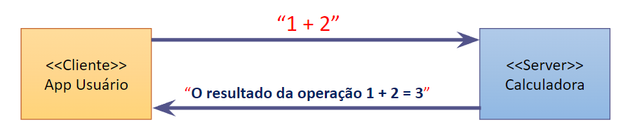

# Calculadora_UDP_com_Java

 Criação de uma calculadora utilizando UDP com interface realizada pelo JFrame (java). Para a realização desse projeto foi utilizados os sequintes requisitos:
 
 Utilizando o exemplo da aula (protocolo “UDP”), escreva uma classe (Server) que atuará como uma calculadora simplificada. No processo servidor, as operações aritméticas de soma (+), subtração (–), multiplicação (*) e divisão (/) são executadas sobre dois números passados na mensagem de um processo cliente. 
A resposta do servidor ao processo cliente será uma mensagem com o resultado da operação entre os dois números enviados.

O “protocolo” da aplicação “Calculadora Remota” deve respeitar as regras: 
O processo cliente deve enviar uma mensagem String no formato:   <num1> <sinal> <num2> 
- Onde num1 e num2 são do tipo float e “sinal” pode ser um char representando as operações aritméticas: [‘+’,  ‘-’ , ‘*’, ‘/’] 
Os operandos e o sinal devem ser separados por espaço (o delimitador). Exemplos: “1 + 2”, “21 – 4.5”, “9 * 2” e “10 / 2”

A resposta que o servidor deve responder ao cliente é a mensagem: “O resultado da operação XXXXXXX  =  YYYYY”
	- Onde XXXXX é a mensagem do cliente e YYYY o resultado da operação.
 
* Todas as mensagens devem ecoar no terminal console, ou usar janela gráfica (Jframe)

### Algumas informações:

i. A porta utilizada é 9876;

ii. O servidor está no arquivo Server.java;

iii. O cliente está funcionando no arquivo Principal.java;

iv. Deve ser ininiado primeiro o Server.java e depois o Principal.java;

v. o projeto completo (alculadora Remota em UDP) está na pasta Atividade1 no arquivo Calculadora_UDP.zip, no qual deve ser descompactado e executado;

vi. quando for executado o arquivo Principal.java, deve se coloca as operações com espacamento, por exemplo, 2 + 2, ou 3 * 2, ou 4 - 2, ou 5 / 2, sendo respeitada as operçãos básimcas de matemática ('+' , '*' , '/' e '-').
